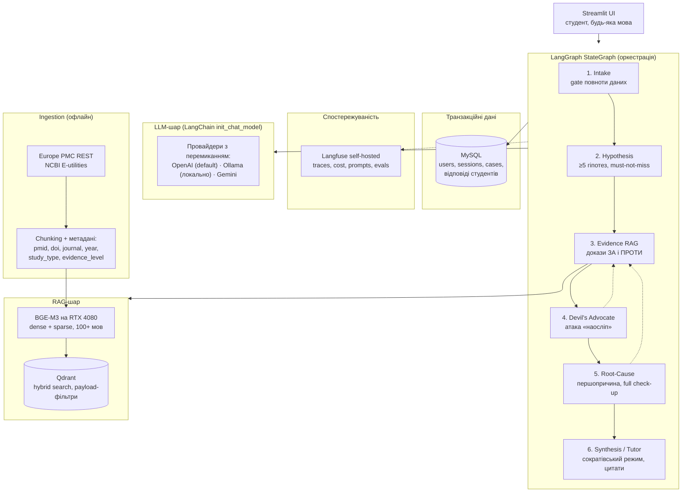
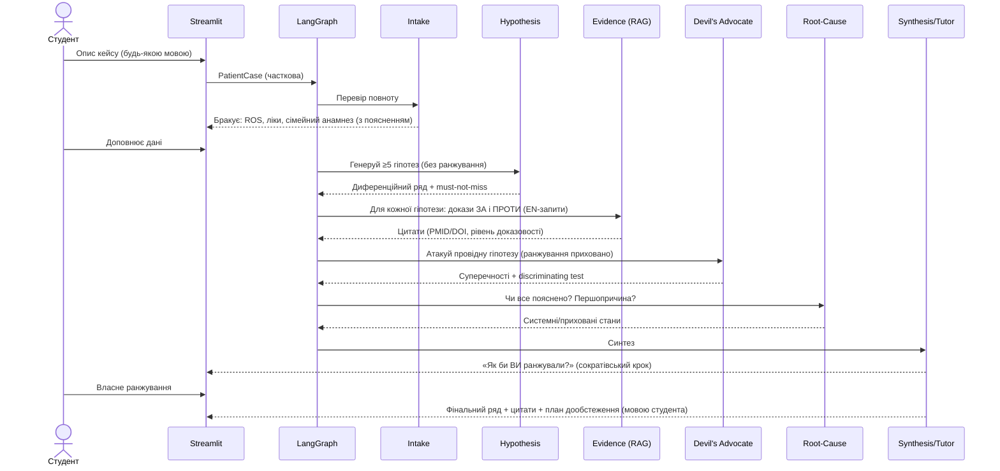

# System Architecture Overview

**Проєкт:** Багатоагентна RAG-система для протидії когнітивним упередженням
у диференційній діагностиці для студентів-медиків

**Статус:** v0.2 (чернетка) · **Дата:** 2026-06-11

---

## 1. Проблема та мета

Молоді лікарі та студенти-медики систематично припускаються діагностичних
помилок через когнітивні упередження. Система архітектурно протидіє кожному
з них окремим механізмом:

| Упередження | Прояв у діагностиці | Механізм протидії в системі |
|---|---|---|
| **Anchoring (якоріння)** | Перша гіпотеза стає «якорем», альтернативи відкидаються | Hypothesis Agent зобов'язаний згенерувати ≥5 гіпотез **до** будь-якого ранжування; Devil's Advocate отримує гіпотези без ранжування |
| **Premature closure** | Діагноз ставиться до завершення збору даних | Intake Agent: формальний gate повноти даних — без обов'язкових полів `PatientCase` перехід до діагнозів заблоковано |
| **Confirmation bias** | Пошук лише підтверджень робочої гіпотези | Evidence Agent виконує **симетричний retrieval**: для кожної гіпотези окремий пошук доказів ЗА і ПРОТИ |
| **Availability bias** | Перевага «нещодавно баченим» діагнозам | Обов'язкова категорія must-not-miss + гіпотеза з іншої системи органів |
| **Search satisficing** | Пошук зупиняється на першому правдоподібному діагнозі | Root-Cause Agent: чи пояснює діагноз **усі** знахідки? чи не є він наслідком глибшого стану? |

Мета — не «поставити діагноз за студента», а змоделювати дисципліновану
діагностичну культуру: повний збір даних, широкий диференційний ряд, активний
пошук спростувань, пошук першопричини (а не лише причини останніх скарг,
ідея «full health check-up»), і обґрунтування кожної гіпотези посиланнями на
відкриті науково-доказові джерела — PubMed/MEDLINE, PubMed Central (PMC),
Europe PMC, DOAJ, BioMed Central, PLOS Medicine, Cureus — **з пріоритетом
рівня доказовості, а не національних протоколів** окремої країни.

> ⚠️ **Дисклеймер:** система — освітній інструмент для студентів-медиків.
> Не призначена для клінічного застосування і не замінює лікаря.

---

## 2. Загальна архітектура

Патерн: **LangGraph state machine + спеціалізовані агенти зі структурованими
дебатами**. Кожен агент — вузол графа зі своїм system prompt, structured
output (Pydantic) і контрольованою видимістю інформації.



---

## 3. Агенти та їхні контракти

Усі агенти — вузли LangGraph; фазовий перехід контролюється графом:
`INTAKE → HYPOTHESES → EVIDENCE → CHALLENGE → ROOT_CAUSE → SYNTHESIS`.
Ключовий принцип анти-bias дизайну — **контроль видимості**: кожен вузол
отримує лише ту частину стану, яка не створює упередження (напр., Devil's
Advocate не бачить ранжування гіпотез).

### 3.1 Intake Agent → протидія *premature closure*
- Структурований збір: скарги, анамнез хвороби/життя, system review, фактори
  ризику, ліки, сімейний анамнез, наявні обстеження.
- Gate повноти: Pydantic-схема `PatientCase` з обов'язковими полями; поки
  поле не заповнене або явно не позначене «недоступно» — граф не переходить
  далі, студенту пояснюється, *яких даних бракує і чому вони важливі*.

### 3.2 Hypothesis Agent → протидія *anchoring*, *availability bias*
- Structured output: **мінімум 5 гіпотез без ранжування**, обов'язково:
  - категорія **must-not-miss** (життєво небезпечні стани);
  - ≥1 гіпотеза з іншої системи органів, ніж «очевидна».

### 3.3 Evidence Agent (RAG) → доказова база
- Для кожної гіпотези **два окремі запити**: докази ЗА і докази ПРОТИ.
- Пошукові запити формулюються **англійською** незалежно від мови діалогу
  (література англомовна); відповідь студенту — його мовою.
- Повертає структуровані цитати: PMID/DOI, журнал, рік, тип дослідження
  (мета-аналіз / систематичний огляд / RCT / когортне / case report), URL.

### 3.4 Devil's Advocate → протидія *confirmation bias*, *anchoring*
- Отримує кейс і гіпотези **без ранжування** («наосліп»).
- Для провідної гіпотези зобов'язаний знайти: дані кейсу, що їй суперечать;
  альтернативне пояснення кожного ключового симптому; **discriminating
  test** — яке одне обстеження найкраще розрізнить топ-2 гіпотези.

### 3.5 Root-Cause Agent → протидія *search satisficing*
- Чи пояснює робочий діагноз **усі** знахідки кейсу?
- Чи не є він наслідком глибшого стану (рецидивні інфекції → імунодефіцит /
  діабет; «симптомне» лікування ≠ усунення причини)?
- Реалізує «full health check-up»: системний погляд на організм.

### 3.6 Synthesis / Tutor Agent
- **Сократівський крок:** спершу пропонує студенту самостійно ранжувати
  гіпотези, потім порівнює і пояснює розбіжності.
- Фінальний ранжований ряд: імовірності, цитати, план дообстеження.
- Явно маркує силу доказів (мета-аналіз/RCT vs case report/expert opinion).

---

## 4. RAG-шар

### 4.1 Джерела (усі відкриті)
| Джерело | Доступ | Що беремо |
|---|---|---|
| Europe PMC | REST API — **основна точка входу** | Покриває PubMed, PMC OA, preprints; абстракти + повні тексти OA |
| PubMed / MEDLINE | NCBI E-utilities | Абстракти + MeSH-метадані (доповнення) |
| PMC OA subset, BMC, PLOS Medicine, Cureus | індексуються в Europe PMC | Повні тексти open access |
| DOAJ | DOAJ API | Верифікація OA-журналів |

### 4.2 Pipeline
1. **Інжест** — пошук за MeSH/ключовими словами доменів, завантаження тільки OA.
2. **Chunking** — секційний (Abstract/Methods/Results/Conclusions),
   ~512–1024 токенів з перекриттям; метадані кожного чанка:
   `pmid, doi, journal, year, study_type, evidence_level, section, url`.
3. **Ембедінги** — **BGE-M3 локально на RTX 4080**: мультилінгвальна
   (100+ мов — критично для мультимовних запитів студентів), генерує dense
   і sparse вектори однією моделлю, безкоштовно й офлайн.
4. **Qdrant** — named vectors (dense + sparse) в одній колекції,
   payload = метадані чанка.
5. **Retrieval** — гібридний пошук (RRF fusion dense+sparse) + payload-фільтри:
   `year ≥ N`, `study_type`, `evidence_level`.
6. **Цитування** — агент цитує лише надані чанки; **програмна перевірка**:
   усі PMID/DOI у відповіді мають бути присутні в retrieved-контексті
   (anti-hallucination, не покладаємось на LLM).

### 4.3 Доказовість понад протоколи
Фільтри/буст по `study_type` та `evidence_level` дають перевагу
систематичним оглядам і мета-аналізам незалежно від країни публікації —
архітектурна відповідь на вимогу не прив'язуватись до національних
протоколів, що можуть лікувати симптоми, а не причину.

---

## 5. Дані: Qdrant + MySQL (розділення відповідальностей)

- **Qdrant** — корпус знань (чанки літератури, вектори, метадані доказовості).
- **MySQL** — транзакційні дані (SQLAlchemy 2 + Alembic):

```
users(id, email, name, locale, created_at)
sessions(id, user_id, status, phase, created_at)          -- діагностичні сесії
cases(id, session_id, patient_case_json, created_at)      -- знеособлені навчальні кейси
hypotheses(id, case_id, name, is_must_not_miss, rank_final)
student_answers(id, session_id, ranking_json, score, feedback_json)
```

LangGraph checkpointer також персистить стан графа (MySQL/SQLite) —
сесію можна продовжити після перезапуску.

---

## 6. LLM-шар: мультипровайдерність

Через LangChain `init_chat_model` — модель кожного агента визначається
**конфігурацією**, не кодом (`src/meddx/config.py`):

| Провайдер | Призначення |
|---|---|
| **OpenAI** (default) | Хмарний провайдер для reasoning-агентів |
| **Ollama** (локально, RTX 4080 12GB) | Безкоштовний офлайн-режим розробки/демо (моделі ~8–14B) |
| **Google Gemini** | Альтернативний хмарний провайдер для порівняння якості |

Per-agent model map: дешевша модель для Intake, сильніша — для Devil's
Advocate і Synthesis. Додавання нового провайдера (напр., Anthropic) —
один рядок конфігурації. Див. [ADR-0003](../adr/0003-multi-provider-llm-via-langchain.md).

---

## 7. Спостережуваність: Langfuse (self-hosted)

- Повний trace кожної сесії: усі вузли графа, промпти, відповіді, токени, кости.
- Самостійний хостинг у docker-compose (дані не покидають хост-машину).
- Підключення — Langfuse `CallbackHandler` у LangChain/LangGraph.
- База для майбутніх evals: повнота диференційного ряду, наявність
  must-not-miss, citation accuracy.

---

## 8. Потік діагностичної сесії



---

## 9. Технологічний стек

| Шар | Вибір | ADR |
|---|---|---|
| Оркестрація | LangGraph (StateGraph + checkpointer) | [0005](../adr/0005-langgraph-orchestration.md) |
| LLM-абстракція | LangChain `init_chat_model`: OpenAI / Ollama / Gemini | [0003](../adr/0003-multi-provider-llm-via-langchain.md) |
| Ембедінги | BGE-M3 локально (RTX 4080) | [0004](../adr/0004-local-bge-m3-embeddings.md) |
| Векторна БД | Qdrant (Docker, hybrid + payload-фільтри) | [0002](../adr/0002-qdrant-vector-db.md) |
| Реляційна БД | MySQL 8 (SQLAlchemy 2 + Alembic) | [0007](../adr/0007-mysql-for-users-and-records.md) |
| Спостережуваність | Langfuse self-hosted | [0006](../adr/0006-langfuse-self-hosted-observability.md) |
| Frontend | Streamlit | — |
| Інжест | Europe PMC REST + NCBI E-utilities | — |

Середовище розробки: Linux (Manjaro), i9-14900HX, RTX 4080 12GB VRAM,
94GB RAM, docker + docker-compose — уся інфраструктура (Qdrant, MySQL,
Langfuse) піднімається локально одним `docker compose up -d`.

---

## 10. Безпека та обмеження
- Освітнє призначення: банер-дисклеймер у UI; відмова від порад із
  самолікування.
- Жодних даних реальних пацієнтів — лише знеособлені навчальні кейси.
- API-ключі — тільки `.env` (не комітиться).
- Anti-hallucination цитат — програмна валідація PMID/DOI проти контексту.

## 11. Відкриті питання (наступні ітерації)
- Evals: датасет кейсів з еталонними диференційними рядами; метрики
  (повнота ряду, must-not-miss recall, citation accuracy) через Langfuse.
- Reranker (локальний bge-reranker-v2-m3) поверх hybrid retrieval.
- Веб-пошук свіжих публікацій поверх локального індексу.
- Персональна аналітика студента: типові упередження → рекомендації.
